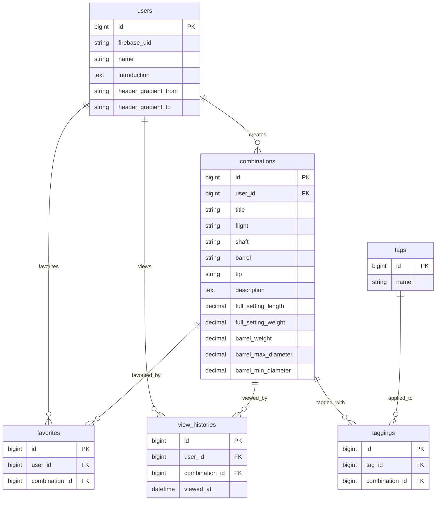

# はじめに

リポジトリをご覧いただきありがとうございます。
こちらはバックエンドのリポジトリです。

フロントエンドは[コチラ](https://github.com/kanori1022/darts_frontend)

かのり(kanori1022)と申します。
簡単に作成したポートフォリオの説明をさせていただきます。

尚、ポートフォリオの稼働時間はコスト軽減のため**9:00 〜 21:00**となっています。

## 1.ポートフォリオ紹介
### (1) 概要
「Combines Darts」(https://combines-darts.link/home)
- ダーツのセッティングを投稿し色んな方と情報を共有するサービスです。
- 自分の求めるダーツの組み合わせを検索や人気ランキングから探すことができます。
___
### (2) 使用イメージ
- 「投稿ページ」
  - 自分の普段使用しているダーツの投稿や、新しく購入したバレルの投稿ができます。
- 「検索ページ」
  - 自分が求めている条件、または#初心者向けなどのタグでの検索が可能です。
- 「お気に入りページ」
  - 自分が気に入った投稿をお気に入りに保存することでいつでもすぐに見直せる機能です。

### (3) サービス開発の背景
- 私はダーツという競技を友人に勧めるのですが、その友人が自分専用のダーツ(マイダーツ)を購入をする際に
  よく悩む姿を見ています。初めてのダーツを購入するにあたり参考になるものがあるといいなと感じていました。
  
- また、ダーツプロの方々がプロモデルのバレルを発売したり、組み合わせ(セッティング)を実は少し変更しています。
  ということを発言をすることがありますが、実物がどうなっているのかはわからないため、イメージすることが難しい時がありました。
  
- そこで、マイダーツのセッティングを共有できるサービスが存在していれば、プロのセッティングや初心者向けに参考にできる様に、
  専用のサービスを開発すれば、すぐに情報を共有することができ、よりダーツを楽しめるのではないかと思い開発を始めました。
___
### （４） 使用技術

1. **フロントエンド**
    - React_[ver.19.0.0]
    - Next.js_[ver.15.5.3]
    - TypeScript_[ver.5.x]
    - TailwindCSS_[ver.4.x]
    - SWR_[ver.2.3.3]（データフェッチング）
    - Axios_[ver.1.9.0]（HTTP通信）
    - Firebase_[ver.11.9.1]（認証）
    　
     
2. **バックエンド**
    - Ruby on Rails_[ver.8.0.2]（APIモード）
    - MySQL2_[ver.0.5.x]
    - JWT_[ver.3.0.x]（認証トークン）
    - Rubocop（コード整形）
    　
     
3. **開発環境**
    - Docker / Docker Compose
    　
     
4. **インフラ**
    - AWS（ECS Fargate、RDS、S3、VPC Endpoint）
    - GitHub Actions（CI/CD）
    - AWS CloudWatch（監視）
    　
     
5. **セキュリティ**
    - Firebase Authentication（ユーザー認証）

___
### (5) 主な実装機能
- **ダーツ検索**
    - 複数キーワード検索
    - タグ検索
    - ユーザー名検索
    　
     
- **マイダーツ投稿**
    - 画像登録
    - 各パーツの名称入力
    - 最大全長や最大径、重さなど
    - 説明入力欄
    - タグ追加(5つまで)
    　
     
- **詳細情報**
    - 他のユーザが投稿しているものを表示
    - タグクリックによるタグ検索
    - 作成者と作成（更新）時間の表示
    - 作成者をクリックで作成者のプロフィールへ画面遷移
    　
     
- **自分の投稿一覧**　
    - 自分が作成した投稿を一覧表示。
    - 自分が作成した投稿は、内容の編集と削除が可能。
    　
     
- **お気に入り登録**
    - 1レシピに対し、1ユーザーは1つまで登録可能。
    - お気に入り総数を表示。 
    　
     
- **人気ランキング**
    - お気に入り総数の上位20件を表示し、順位をナンバリング。
    - 上位3件については王冠を表示。
    　
     
- 　**新着一覧**
    - 作成日の新しい20件を表示。
    　
     
- 　**ユーザー認証（FireBase）**
    - メールアドレスとパスワードはデータベースではなくFireBase上に保存しセキュリティを強固にする。
    - メール認証（新規登録・ログイン）
    - ゲストログイン機能
___
### (6) 構成図など
#### 1. インフラ構成図

#### 2. ER図

#### 3.当初のデザイン案（figma）

___
### (7) 特にこだわった点
- ユーザ目線で操作した時に操作説明がなくとも直感的に操作をしやすくなるようにUI/UX周りを何度も修正しながら検証した。
- 投稿ページにて入力必須項目と任意項目を分けることにより、ダーツに慣れていない人でも投稿が簡単にできるように作成をした。
___

## 2. 技術の選定
技術選定で意識したことと、主な技術の選定理由は以下の通りです。
### （１） 意識したこと

- **モダンな技術を採用する。**
    - Web業界は次々と新しい技術が登場するため、常にキャッチアップが欠かせない。
      そのため、基盤となるモダンな技術を学ぶことが、新しい技術に柔軟に順応する力の習得につながると考えている。
      
    - また、モダンな技術は今後さらに開発現場での採用が進むと予想される。
      より実践に近い技術を学ぶことで、早い段階から現場で活かせる力の獲得を目指している。
    　
     
- **情報が多く学びやすい技術を採用する。**
    - プログラミング初学者はエラーなどにつまずくことが多い。
      情報が豊富な技術を選ぶことで、自己解決が容易になり、学習や開発のハードルを下げられると判断した。
      
    - さらに、多くの開発者に利用されている技術であれば、周辺ツールやライブラリも充実しており、開発効率の向上も期待できる。
___
### （２） 主な技術の選定理由
1. **フロントエンド**

### **React / Next.js**
- **使用用途**: フロントエンドのライブラリおよびフレームワークとして使用。SPAで運用
- **比較対象**: Vue.js / Nuxt.js
- **採用理由**: 
  - Reactはコンポーネントベースの開発が可能で再利用性が高い
  - コンポーネントの親子関係が明確で、Vue.jsと比較しても大規模なアプリケーションでも管理がしやすい
  - Next.jsはファイルベースルーティングが可能で効率的に開発可能な他、SSRでの運用等も可能となる
  - 今回はユーザーにストレスフリーでスムーズな操作性を目的としたため、差分レンダリングであるSPAで運用している

### **TypeScript**
- **使用用途**: フロントエンドの開発言語
- **比較対象**: JavaScript
- **採用理由**:
  - 既存のJavaScriptコードをそのまま利用することができる上で、静的型付けが可能
  - 変数や関数の型を事前に指定することで、バグの早期発見やコードの可読性や安全性が向上する
  - 大規模なアプリケーション開発において、型安全性により保守性が向上する

### **TailwindCSS**
- **使用用途**: CSSフレームワークとして使用
- **比較対象**: Bootstrap、Material-UI
- **採用理由**: 
  - 事前に定義された多くのクラスを使用することで、開発効率が向上する
  - カスタマイズ性と柔軟性が高いため、あらゆるデザインに対応できる
  - ユーティリティファーストのアプローチにより、一貫したデザインシステムを構築できる
  - バンドルサイズの最適化により、不要なCSSが含まれない

### **SWR**
- **使用用途**: データフェッチングライブラリ
- **比較対象**: React Query、Apollo Client
- **採用理由**:
  - シンプルなAPIでキャッシュ機能を提供
  - リアルタイムデータ同期やエラーハンドリングが容易
  - 軽量で学習コストが低い

### **Axios**
- **使用用途**: HTTPクライアントライブラリ
- **比較対象**: Fetch API、jQuery.ajax
- **採用理由**:
  - リクエスト/レスポンスのインターセプト機能
  - 自動的なJSONデータ変換
  - ブラウザ互換性が高い

### **Firebase**
- **使用用途**: 認証サービス
- **比較対象**: Auth0、AWS Cognito
- **採用理由**:
  - 簡単に認証機能を実装できる
  - Google認証など、SNS認証の統合が容易
  - 無料プランで十分な機能を提供

## 2. バックエンド

### **Ruby / Ruby on Rails**
- **使用用途**: バックエンドの開発言語とフレームワークとして使用（APIモードで運用）
- **比較対象**: Go、Python/Django、PHP/Laravel、Node.js/Express
- **採用理由**: 
  - MVCモデルに基づいており、データベースの操作も容易で、効率的に開発が可能
  - Convention over Configurationの思想により、開発速度が向上する
  - 豊富なGemライブラリにより、機能拡張が容易
  - Active Recordにより、データベース操作が直感的
  - インターネット教材が豊富なことから情報も習得しやすい

### **MySQL**
- **使用用途**: リレーショナルデータベース
- **比較対象**: PostgreSQL、SQLite
- **採用理由**:
  - Railsとの親和性が高い
  - 安定性とパフォーマンスのバランスが良い
  - AWS RDSでの運用が容易

### **JWT**
- **使用用途**: 認証トークンの生成・検証
- **比較対象**: Session認証、OAuth
- **採用理由**:
  - ステートレスな認証が可能
  - スケーラビリティが高い
  - マイクロサービス間での認証情報共有が容易

## 3. コンテナ・開発環境

### **Docker / Docker Compose**
- **使用用途**: バックエンドの開発環境および本番環境の構築
- **比較対象**: VirtualBox、直接インストール
- **採用理由**: 
  - Dockerは他の端末でも同じ開発環境を容易に再現することが可能
  - VirtualBoxと比較して、コンテナ化技術によりOS等の環境差異による問題や手間を減らすことが可能
  - より軽量で素早く起動することができる
  - Docker ComposeはバックエンドのRailsと開発環境でのデータベース（MySQL）など、複数コンテナの一括管理が可能

## 4. インフラ

※ 以下の理由から、主にAWS（Amazon Web Services）サービスを採用した。
- GCPと比較してインターネット上で実装に関する情報が豊富
- RenderやHerokuでは読み込み速度が遅い
- AWSは幅広いサービスを提供しており、他のサービスとの親和性が高く、一元的な管理が可能

### **ECS Fargate**
- **使用用途**: バックエンドのサーバー（バックエンドのコンテナ(Docker)をデプロイ・管理）
- **比較対象**: EC2、AWS Lambda
- **採用理由**: 
  - ECR上に保持したコンテナ(Docker)をそのままデプロイ可能
  - EC2と比較して、サーバーに必要なリソース(処理能力やメモリなど)をAWSが自動的に調整してくれるため、手動でのサーバー管理の必要が無い
  - サーバーレスコンテナとして、スケーリングが自動化されている
  - 運用コストを抑えながら、高い可用性を提供

### **AWS RDS**
- **使用用途**: マネージドデータベースサービス
- **比較対象**: EC2上でのMySQL自運用
- **採用理由**:
  - 自動バックアップとポイントインタイム復旧
  - 自動スケーリングとパフォーマンス最適化
  - セキュリティパッチの自動適用
  - 高可用性のMulti-AZ配置

### **AWS S3**
- **使用用途**: ファイルストレージ（Active Storage用）
- **比較対象**: ローカルストレージ、Google Cloud Storage
- **採用理由**:
  - 高い耐久性と可用性
  - Rails Active Storageとの統合が容易
  - CDNとの連携による高速配信
  - コスト効率が良い

### **GitHub Actions**
- **使用用途**: バックエンドのCI/CDパイプライン
- **比較対象**: CircleCI、Jenkins
- **採用理由**: 
  - バックエンドのプッシュからデプロイまでを自動化できる
  - GitHub Actionsのみ制限無しで無料利用が可能（パブリックレポジトリの場合）
  - GitHubリポジトリと直接統合されていて、管理しやすい
  - ECS Fargateへの自動デプロイが容易

### **AWS VPC Endpoint**
- **使用用途**: プライベートネットワーク経由でのAWSサービスアクセス
- **採用理由**:
  - インターネットを経由せずにAWSサービスにアクセス可能
  - セキュリティの向上
  - データ転送コストの削減
  - ネットワークレイテンシの削減

## 5. 運用・監視

### **AWS CloudWatch**
- **使用用途**: ログ収集・監視
- **採用理由**:
  - AWSサービスとの統合が容易
  - アラート設定による障害の早期発見
  - コスト効率の良い監視ソリューション

ここまでお読みいただきありがとうございます。
少しでも興味を持っていただけたら幸いです。

  
